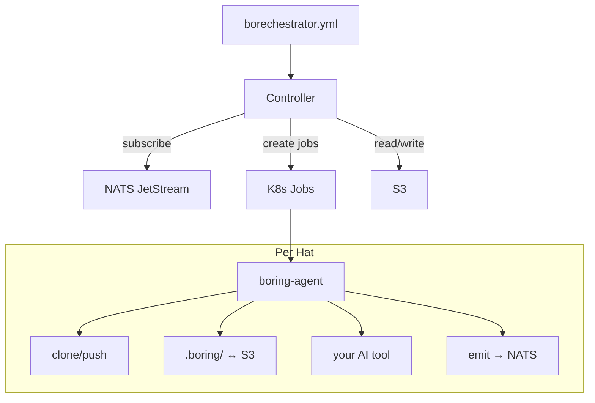

# borechestrator

The world's most boring AI agent orchestrator.

*Your agents scale until AWS and Anthropic both send you emails.*

**You probably don't need this.** If your agents fit on one machine, use [Ralph](https://github.com/mikeyobrien/ralph-orchestrator). It's simpler and it's what I based this on. Borechestrator is for when you've outgrown a single box and need the agents to run as K8s Jobs, share state through S3, and coordinate through a message broker. If that sentence didn't make you nod, close this tab.

## What is it?

It's a YAML file that describes which AI agents run, what events trigger them, and what events they produce. The orchestrator reads the YAML, watches a NATS topic, and creates K8s Jobs. State goes in S3. Code goes in git. Credentials come from wherever you already keep them.

That's it.

- **K8s Jobs** for execution. Scheduling, retries, resource limits, RBAC — all free.
- **NATS JetStream** for events. Wildcard routing, persistence.
- **S3-compatible storage** for shared state. RustFS, MinIO, actual S3, whatever.
- **K8s Secrets / env vars / AWS SM / Azure KV** for credentials.

Your platform team has been running all of this for decades.

## Does it work?

Yes. Here's a real run — a contract-first fullstack pipeline. Claude agents drafted an API contract, then concurrently built an Express.js backend and HTML frontend, pushed to GitHub, all across K8s pods:

```
spec_writer (K8s Job) → drafted API contract → S3
  → spec_reviewer (K8s Job) → approved
    → backend_builder (K8s Job) → server.js, package.json → GitHub
    → frontend_builder (K8s Job) → index.html → GitHub
      → verifier (K8s Job) → checked both against contract
```

Code: [krlohnes/boring-bookmark-demo](https://github.com/krlohnes/boring-bookmark-demo).

Cyclic patterns work too. A QA hat rejected a [towers of hanoi](https://github.com/krlohnes/boring-bookmark-demo/blob/bore/run-6954d271/main/hanoi.py) for using recursion. The implementer rewrote it. QA reviewed again. Events bounced between hats until QA was satisfied. No supervisor.

## Config

It's YAML.

```yaml
event_loop:
  starting_event: work.start
  completion_promise: LOOP_COMPLETE
  max_iterations: 20

cli:
  backend: claude
  model: sonnet

runtime:
  mode: k8s
  namespace: default
  default_image: borechestrator/claude-agent:latest

broker:
  url: nats://127.0.0.1:4222
  pod_url: nats://nats.default.svc:4222

store:
  endpoint: http://rustfs:9000
  bucket: borechestrator

git:
  repo: https://github.com/org/project.git
  base_branch: main
  branch_strategy: shared
  credentials:
    from_secret: github-token

hats:
  planner:
    name: Planner
    description: "Breaks work into sub-tasks"
    triggers: ["work.start", "subtask.done"]
    publishes: ["subtask.ready"]
    secret_mounts:
      - from_secret: claude-credentials
        mount_path: /home/agent/.claude/.credentials.json
    instructions: |
      Read the task. Break it into sub-tasks.

  builder:
    name: Builder
    description: "Implements a sub-task"
    triggers: ["subtask.ready"]
    publishes: ["subtask.done"]
    secret_mounts:
      - from_secret: claude-credentials
        mount_path: /home/agent/.claude/.credentials.json
    instructions: |
      Implement the sub-task. Write the code.
      Commit and push.
```

You don't need a `command:` field. `cli.backend` handles it. You don't need stdout markers. The `emit` CLI handles events. You don't need to manage `.boring/` state. `boring-agent` does it.

## Events

Agents call the `emit` CLI tool. It's in the container.

```bash
emit subtask.ready "done with parsing"
emit --complete
emit --memory pattern "use snake_case"
emit --task add "implement auth"
```

If the agent forgets to call `emit`, the reconciler auto-emits the hat's default topic. The pipeline keeps moving.

Topic wildcards are NATS-compatible. `work.*` matches `work.start`. `work.>` matches `work.sub.deep`. `>` matches everything. I didn't invent a pattern syntax. NATS already had one.

## Running it

```bash
# Local dev
./scripts/dev-up.sh
boring run -c borechestrator.yml

# Kubernetes
./scripts/k8s-up.sh
boring run -c borechestrator.yml --mode k8s
```

There are 12 presets if you don't want to write YAML from scratch.

```bash
boring init --list
boring init feature
```

## Secrets

Env vars, files, K8s Secrets. In that order. Checked automatically.

```bash
# Option 1: env var
export BORING_SECRET_API_KEY=sk-...

# Option 2: file
echo "sk-..." > ~/.boring/secrets/api-key

# Option 3: K8s Secret (auto-checked in k8s mode)
kubectl create secret generic api-key --from-literal=value=sk-...
```

```yaml
# In your config
env:
  API_KEY:
    from_secret: api-key
```

For file-based credentials (OAuth tokens, SSH keys):

```yaml
secret_mounts:
  - from_secret: claude-credentials
    mount_path: /home/agent/.claude/.credentials.json
```

AWS Secrets Manager and Azure Key Vault are behind feature flags.

## Agent images

You build the container. There are Dockerfiles here. Have fun. Your existing infrastructure runs it.

```dockerfile
FROM borechestrator/agent:latest
RUN npm install -g @anthropic-ai/claude-code
```

`boring-agent` is the entrypoint. It clones your repo, materializes `.boring/` from S3, runs your AI tool, syncs state back, pushes code, publishes events to NATS. Your Dockerfile just needs the AI CLI installed.

Each hat can use a different image, model, or tool. Put Claude on the builder. Put Codex on the reviewer. Nobody said they had to agree.

## The `.boring/` directory

Every agent gets one. Materialized from S3 before the command runs.

```
.boring/
  prompt.md         # what to do
  event.json        # why you were woken up
  scratchpad/       # shared notes between hats
  memories.md       # stuff learned in previous iterations
  tasks.md          # work items
```

It's just files. `grep` works. `cat` works. Your AI tool reads them like any other file. No SDK. No API. No plugin.

## Monitoring

```bash
kubectl get pods -l app.kubernetes.io/managed-by=borechestrator
kubectl logs <pod-name>
```

There's also `boring status` and `boring logs` if you want. OTel tracing behind `--features otel`. Structured JSON logs to stdout. Prometheus metrics.

There is no TUI. There is no web UI. There is no dashboard. You have `kubectl`. It's fine. If you want a TUI, there's [k9s](https://k9scli.io/).

## Architecture



Eight crates. Most of them are trait + implementation pairs. The interesting one is `boring-controller` which has the reconciler loop — the actual orchestrator. It's about 300 lines.

## What this is not

Not an AI framework. Not an API wrapper. Not a conversation manager. Not a prompt chain library.

It's the plumbing between AI agents that already exist. You bring the agent. I bring the `kubectl`.

## Name

It's called borechestrator because it's boring. If your orchestrator is exciting, something has gone wrong.

## License

MIT. Based on [Ralph orchestrator](https://github.com/mikeyobrien/ralph-orchestrator) (also MIT).
