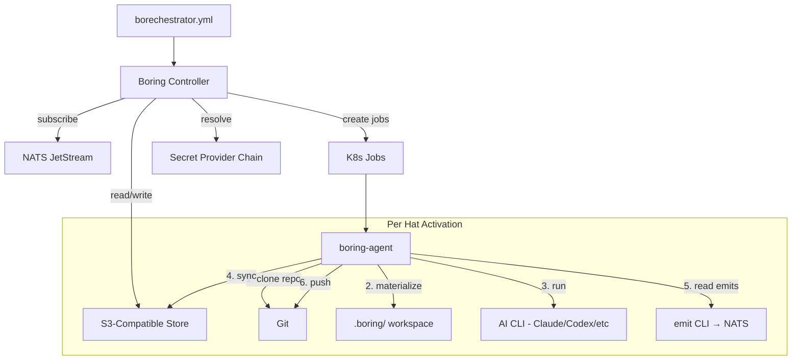

# borechestrator

The world's most boring AI agent orchestrator.

*Your agents scale until AWS and Anthropic both send you emails.*

**You probably don't need this.** If your agents fit on one machine, use [Ralph](https://github.com/mikeyobrien/ralph-orchestrator). It's simpler and it's what I based this on. Borechestrator is for when you've outgrown a single box and need the agents to run as K8s Jobs, share state through S3, and coordinate through a message broker. If that sentence didn't make you nod, close this tab.

## Why?

Because every AI agent orchestrator is trying to be clever, and I'm tired of it.

An AI agent orchestrator is just the AI agent loop, but with the ability to call other agents as tools. That's it. That's the whole idea. You don't need a novel framework. You don't need a new paradigm. You don't need seventeen abstractions over "send a message and wait for a response."

You know what you need? A message broker, an object store, and a job scheduler. Your platform team has been running these for decades. They're boring. They work.

Borechestrator takes the conceptual model from [Ralph orchestrator](https://github.com/mikeyobrien/ralph-orchestrator) — which is damn near perfect for local agent orchestration — and makes it work across machines. No magic. Just the boring cloud-native stuff your IT department already knows how to operate:

- **K8s Jobs** for agent execution (scheduling, retries, resource limits, RBAC — all free)
- **NATS JetStream** for events (wildcard routing, persistence, exactly-once delivery)
- **S3-compatible storage** for shared state (versioned, IAM-controlled, boring)
- **K8s Secrets / env vars / AWS Secrets Manager / Azure Key Vault** for credentials

Your security team already knows how to audit this. Your platform team already knows how to monitor this. Your oncall already knows how to debug this.

It's just K8s. It's just NATS. It's just S3. It's just boring.

## What It Actually Does

You write a YAML config that defines "hats" — specialized agent roles that trigger on events and publish new events when done. Borechestrator creates a K8s Job for each hat activation, routes events through NATS, shares state through S3, and pushes code to git. Each hat runs Claude (or any AI CLI) in full agent mode inside a container.

Here's a real run that happened today — a contract-first fullstack pipeline where Claude agents wrote an Express.js bookmark manager API and HTML frontend, pushed to GitHub, all orchestrated across K8s pods:

```
spec_writer (K8s Job) → drafted API contract → pushed to S3
  → spec_reviewer (K8s Job) → approved
    → backend_builder (K8s Job) → wrote server.js, package.json → pushed to GitHub
    → frontend_builder (K8s Job, concurrent) → wrote index.html → pushed to GitHub
      → verifier (K8s Job) → checked both against contract
```

The code landed at [krlohnes/boring-bookmark-demo](https://github.com/krlohnes/boring-bookmark-demo).

## Config

```yaml
event_loop:
  starting_event: work.start
  completion_promise: LOOP_COMPLETE
  max_iterations: 20
  max_runtime_seconds: 3600

cli:
  backend: claude
  model: sonnet  # save your credits

runtime:
  mode: k8s
  namespace: default
  default_image: borechestrator/claude-agent:latest

broker:
  url: nats://127.0.0.1:4222
  pod_url: nats://nats.default.svc:4222  # what pods use

store:
  endpoint: http://rustfs:9000
  bucket: borechestrator

git:
  repo: https://github.com/org/project.git
  base_branch: main
  branch_strategy: shared
  credentials:
    from_secret: github-token

hats:
  planner:
    name: Planner
    description: "Breaks work into sub-tasks"
    triggers: ["work.start", "subtask.done"]
    publishes: ["subtask.ready"]
    secret_mounts:
      - from_secret: claude-credentials
        mount_path: /home/agent/.claude/.credentials.json
    instructions: |
      Read the task. Break it into sub-tasks.

  builder:
    name: Builder
    description: "Implements a sub-task"
    triggers: ["subtask.ready"]
    publishes: ["subtask.done"]
    secret_mounts:
      - from_secret: claude-credentials
        mount_path: /home/agent/.claude/.credentials.json
    instructions: |
      Implement the sub-task. Write the code.
      Commit and push your changes.
```

No `command:` field needed — `cli.backend` handles invocation. No `BORING_EMIT` stdout markers needed — the `emit` CLI tool handles event emission. No `.boring/` management needed — `boring-agent` handles S3 sync and git.

### The `emit` CLI

Agents signal events by calling the `emit` CLI tool (installed in the container):

```bash
emit subtask.ready "implemented the parser"    # emit an event
emit --complete                                 # signal the run is done
emit --memory pattern "always use snake_case"   # save a learning
emit --task add "implement auth"                # create a task
emit --scratchpad "step 3 done"                 # append to shared scratchpad
```

If the agent doesn't call `emit`, the reconciler auto-emits the hat's default publish topic to keep the pipeline moving.

### Topic Wildcards

NATS-compatible. Because why invent a new pattern matching syntax.

- `work.start` — exact match
- `work.*` — matches `work.start`, `work.done`, not `work.sub.deep`
- `work.>` — matches everything under `work.`
- `>` — matches everything

## Architecture



### Crates

| Crate | What it does |
|---|---|
| `boring-proto` | Types: Topic, Event, Config. Zero heavy deps. |
| `boring-broker` | Broker trait + NATS JetStream |
| `boring-store` | Store trait + local filesystem + S3 |
| `boring-runtime` | Runtime trait + local process + Docker + K8s Jobs |
| `boring-secrets` | SecretProvider trait + env, file, K8s Secrets, AWS SM, Azure KV |
| `boring-controller` | Event router, job builder, reconciler loop, memories, tasks |
| `boring-agent` | Container entrypoint: git, S3 sync, .boring/ workspace, emit |
| `boring-cli` | The `boring` CLI binary |

### Secret Resolution

In K8s mode: env vars → `~/.boring/secrets/` files → K8s Secrets.

```yaml
env:
  API_KEY:
    from_secret: my-api-key   # resolved through the chain

secret_mounts:
  - from_secret: claude-credentials              # K8s Secret name
    mount_path: /home/agent/.claude/.credentials.json  # mounted as file
```

## Quick Start

### Local Dev

```bash
./scripts/dev-up.sh              # Start NATS + RustFS
boring init feature               # Scaffold a config
boring validate -c borechestrator.yml
boring run -c borechestrator.yml  # Local mode (no K8s needed)
./scripts/dev-down.sh
```

### Kubernetes

```bash
./scripts/k8s-up.sh              # Deploy NATS + RustFS via Helm

# Build the agent image
docker build -f Dockerfile.claude-agent -t borechestrator/claude-agent:latest .

# Create secrets
kubectl create secret generic claude-credentials \
  --from-file=.credentials.json=path/to/credentials.json

# Run
boring run -c borechestrator.yml --mode k8s

./scripts/k8s-down.sh
```

### Presets

```bash
boring init --list
```

12 presets: feature, tdd, research, debug, review, minimal, spec-driven, mob, refactor, pr-review, docs, deploy.

## Building Agent Images

Borechestrator doesn't care what's in the container. You bring the agent. I bring the plumbing.

```dockerfile
FROM borechestrator/agent:latest

# Add your AI tool
RUN npm install -g @anthropic-ai/claude-code

# Add your MCP servers, skills, whatever
COPY .claude/ /home/agent/.claude/
```

### Mixed Models

Each hat can use a different tool, model, or container image:

```yaml
cli:
  backend: claude
  model: sonnet        # default model

hats:
  builder:
    # Uses default (Claude Sonnet)
    instructions: "Build the feature..."

  reviewer:
    image: ghcr.io/myorg/codex-reviewer:latest
    command: "codex \"$BORING_PROMPT\""
    instructions: "Review for correctness..."
```

### The `.boring/` Directory

Every agent gets a `.boring/` workspace materialized from S3:

```
.boring/
  prompt.md         # assembled prompt
  event.json        # current event context
  scratchpad/       # shared notes (cross-hat visible)
  memories.md       # learnings from previous iterations
  tasks.md          # task checklist
```

Your AI tool greps and reads these like any files. No special API needed.

### What Borechestrator Is Not

Borechestrator is not a framework for building AI agents. It doesn't wrap the Anthropic API. It doesn't manage conversation history. It doesn't handle tool use or function calling.

Borechestrator is the boring glue between agents that already exist. You bring the agent. I bring the plumbing.

## Name

It's called borechestrator because it's boring. That's the point. If your orchestrator is exciting, something has gone wrong.

## License

MIT. Inspired by [Ralph orchestrator](https://github.com/mikeyobrien/ralph-orchestrator) (also MIT).
