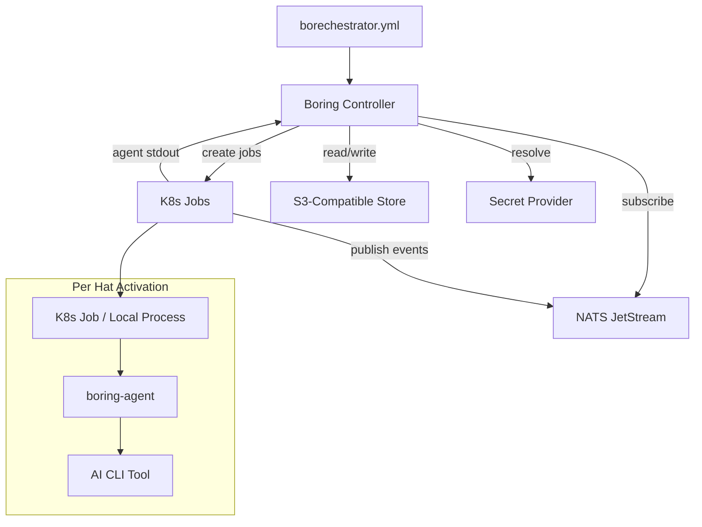
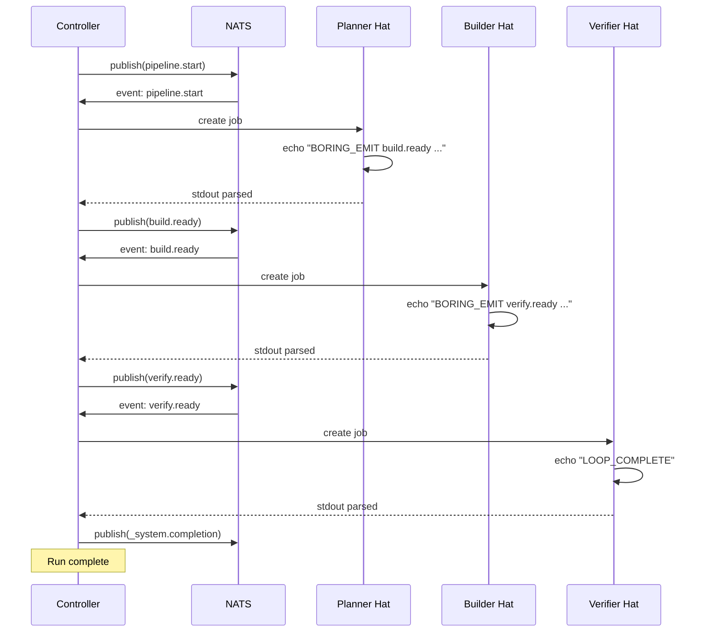
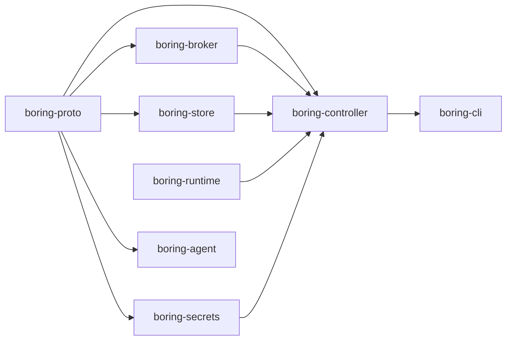
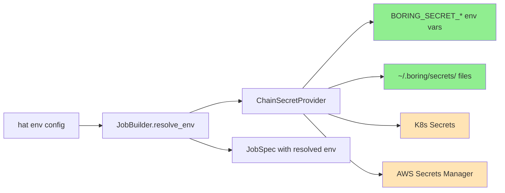

# borechestrator

The world's most boring AI agent orchestrator.

## Why?

Because every AI agent orchestrator is trying to be clever, and we're tired of it.

An AI agent orchestrator is just the AI agent loop, but with the ability to call other agents as tools. That's it. That's the whole idea. You don't need a novel framework. You don't need a new paradigm. You don't need seventeen abstractions over "send a message and wait for a response."

You know what you need? A message broker, an object store, and a job scheduler. Your platform team has been running these for decades. They're boring. They work.

Borechestrator takes the conceptual model from [Ralph orchestrator](https://github.com/mikeyobrien/ralph-orchestrator) — which is damn near perfect for local agent orchestration — and makes it work across machines. No magic. Just the boring cloud-native stuff your IT department already knows how to operate:

- **K8s Jobs** for agent execution (scheduling, retries, resource limits, RBAC — all free)
- **NATS JetStream** for events (wildcard routing, persistence, exactly-once delivery)
- **S3-compatible storage** for scratchpads (versioned, IAM-controlled, boring)
- **K8s Secrets / env vars / AWS Secrets Manager** for credentials (pick your boring)

Your security team already knows how to audit this. Your platform team already knows how to monitor this. Your oncall already knows how to debug this. Nobody needs to learn a new permission model, a new observability stack, or a new deployment pipeline.

It's just K8s. It's just NATS. It's just S3. It's just boring.

## Architecture

### The Big Picture



### Event Flow

Hats are specialized agent personas. Each hat subscribes to event topics and publishes new events when done. The controller routes events to hats based on trigger patterns. That's the whole orchestration model.



### Crate Structure



| Crate | What it does |
|---|---|
| `boring-proto` | Types: Topic, Event, Config. Zero heavy deps. |
| `boring-broker` | Broker trait + NATS JetStream implementation |
| `boring-store` | Store trait + local filesystem (S3 coming) |
| `boring-runtime` | Runtime trait + local process (K8s coming) |
| `boring-secrets` | SecretProvider trait + env, file, K8s, AWS impls |
| `boring-controller` | Event router, job builder, reconciler loop |
| `boring-cli` | The `boring` CLI binary |
| `boring-agent` | Runs inside containers (coming soon) |

### Secret Resolution



Green = implemented. Orange = feature-gated, needs `--features k8s` or `--features aws`.

## Config

Borechestrator uses a YAML config that's a superset of Ralph's format. If you know Ralph, you know this.

```yaml
event_loop:
  starting_event: work.start
  completion_promise: LOOP_COMPLETE
  max_iterations: 50

hats:
  planner:
    name: Planner
    description: "Breaks work into sub-tasks"
    triggers: ["work.start", "subtask.done"]
    publishes: ["subtask.ready"]
    command: "claude --print \"$BORING_PROMPT\""
    instructions: |
      Read the task. Break it into sub-tasks.
      Emit BORING_EMIT subtask.ready for each one.
    env:
      ANTHROPIC_API_KEY:
        from_secret: anthropic-api-key

  builder:
    name: Builder
    description: "Implements a sub-task"
    triggers: ["subtask.ready"]
    publishes: ["subtask.done"]
    command: "claude --print \"$BORING_PROMPT\""
    instructions: |
      Implement the sub-task described in the event payload.
      When done, emit BORING_EMIT subtask.done.
    env:
      ANTHROPIC_API_KEY:
        from_secret: anthropic-api-key
```

### Event Convention

Agents emit events by printing to stdout:

```
BORING_EMIT <topic> <payload>
```

The completion promise (e.g., `LOOP_COMPLETE`) anywhere in stdout signals the run is done.

### Topic Wildcards

NATS-compatible. Because why invent a new pattern matching syntax.

- `work.start` — exact match
- `work.*` — matches `work.start`, `work.done`, not `work.sub.deep`
- `work.>` — matches `work.start`, `work.sub.deep`, everything under `work.`
- `>` — matches everything

## Quick Start

### Local Dev

```bash
# Start NATS + RustFS
./scripts/dev-up.sh

# Validate a config
cargo run -p boring-cli -- validate -c my-config.yml

# Run an orchestration
cargo run -p boring-cli -- run -c my-config.yml

# Tear down
./scripts/dev-down.sh
```

### Kubernetes

```bash
# Deploy NATS + RustFS via Helm
./scripts/k8s-up.sh

# Tear down
./scripts/k8s-down.sh
```

### Secrets

Set secrets as env vars:

```bash
export BORING_SECRET_ANTHROPIC_API_KEY=sk-ant-...
```

Or drop them in files:

```bash
echo "sk-ant-..." > ~/.boring/secrets/anthropic-api-key
```

Then reference them in your config:

```yaml
env:
  ANTHROPIC_API_KEY:
    from_secret: anthropic-api-key
```

## Status

This is early. The local-mode pipeline works end-to-end. Here's what exists and what doesn't:

- [x] YAML config parsing (Ralph-compatible superset)
- [x] NATS-compatible topic wildcard matching
- [x] Event routing with specificity priority
- [x] Local process runtime
- [x] Local filesystem store
- [x] Reconciler loop (the actual orchestrator)
- [x] Stdout event parsing (`BORING_EMIT`)
- [x] Secret management (env, file, K8s, AWS)
- [x] CLI: `validate`, `run`, `emit`
- [x] End-to-end tests against live NATS
- [ ] K8s Job runtime
- [ ] Docker runtime
- [ ] S3 store implementation
- [ ] `boring-agent` container wrapper
- [ ] Git integration (clone, branch, push per job)
- [ ] Backpressure gates
- [ ] Wave/concurrency support
- [ ] Observability (OpenTelemetry)
- [ ] `boring init` scaffolding

## Name

It's called borechestrator because it's boring. That's the point. If your orchestrator is exciting, something has gone wrong.

## License

MIT. Inspired by [Ralph orchestrator](https://github.com/mikeyobrien/ralph-orchestrator) (also MIT).
